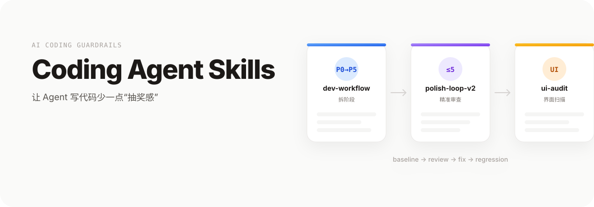

<p align="center">
  <a href="README.md">中文</a> | <a href="README.en.md">English</a>
</p>

<p align="center">
  
</p>

<p align="center">
  A personal set of AI coding skills to make Agent-driven development feel less like a lottery
</p>

<p align="center">
  <a href="#quick-start">🚀 Quick Start</a> ·
  <a href="#recommended-workflow">📖 Workflow</a> ·
  <a href="#real-world-cases">📝 Cases</a> ·
  <a href="#pitfalls-we-hit">🐛 Pitfalls</a>
</p>

---

## One-click Setup

If you don't want to install manually, paste this prompt into your Coding Agent (Trae / Codex / Claude Code) and let it do the rest:

```text
Please install and configure the skills from https://github.com/ECdison6227/coding-agent-skills:

1. Git clone the repo into a temporary directory
2. Run ./install.sh to install the skills
3. Tell me which skills were installed, what each does, and their trigger words
4. If any skill needs initial setup (profile, preferences), guide me through it
5. Finally, demo how to invoke one of the skills with a simple example
```

---

## Table of Contents

- [Why I built these skills](#why-i-built-these-skills)
- [What it can / cannot do](#what-it-can--cannot-do)
- [Quick start](#quick-start)
- [Recommended workflow](#recommended-workflow)
- [Standard prompts](#standard-prompts)
- [Real-world cases](#real-world-cases)
- [How it works](#how-it-works)
- [Key configuration](#key-configuration)
- [Pitfalls we hit](#pitfalls-we-hit)
- [Limitations and next steps](#limitations-and-next-steps)
- [Related repos](#related-repos)
- [Feedback](#feedback)
- [Thanks](#thanks)
- [License](#license)

---

## Why I built these skills

I've been using Agent tools like Trae, Claude Code, and Codex for a while. At first it felt magical: say "build me a login page" and the Agent spits out code. But after using them long enough, a few annoying patterns kept showing up:

1. **The Agent drifts.** Round one looks good. Round two it "optimizes" unrelated files. Round three it breaks what round one fixed. Without a hard loop limit, it can go on forever.
2. **It reviews code but never runs it.** Static scan says "looks fine," then the app crashes on start, a route 404s, or a button does nothing.
3. **Frontend UI is always 90% done.** The logic works, but the UI is full of vague labels like "OK / Cancel," hardcoded Chinese strings, and static loading spinners.
4. **It talks about git but doesn't commit.** I say "remember to commit," it says "sure," and then nothing happens.

These skills are my attempt to turn those recurring failures into reusable guardrails. Not a universal toolbox—more like a checklist of "don't make the same mistake again."

---

## What it can / cannot do

| Can do | Cannot do |
|--------|-----------|
| Split a large project into 6 phases via `dev-workflow` so the Agent never reads every file at once | Write business logic for you—it only handles process and guardrails |
| Run up to 5 focused review rounds via `polish-loop-v2`, each round targeting only changed files | Guarantee zero bugs; it only reduces the odds of "fix one, break three" |
| Scan for text symbols, hardcoded Chinese, undefined CSS classes, and missing loading/empty/error states via `ui-audit` | Replace a designer; it only catches obvious problems |
| Work with [project-guardian](https://github.com/ECdison6227/project-guardian-cheap-code-delegate) to auto-run `git init` / `add` / `commit` | Auto-run dangerous commands like `push`, `reset`, or `clean` without your confirmation |

---

## Quick start

```bash
# 1. Clone the repo
git clone https://github.com/ECdison6227/coding-agent-skills.git
cd coding-agent-skills

# 2. Validate the repo structure
./scripts/validate.sh

# 3. Install to the default skill directory
./install.sh
```

Default install path: `~/.agents/skills`. To install elsewhere:

```bash
./install.sh --target "$HOME/.codex/skills"
```

To preview what will be installed:

```bash
./install.sh --dry-run
```

---

## Recommended workflow

The three skills can be used together or standalone. Recommended pairing with [project-guardian](https://github.com/ECdison6227/project-guardian-cheap-code-delegate):

```
┌─────────────────┐
│  project-guardian │ ── auto git init / add / commit, establish baseline
│  (companion repo) │
└────────┬────────┘
         │
         ↓
┌─────────────────┐     ┌──────────────────┐     ┌──────────────────┐
│  dev-workflow   │ ──→ │  polish-loop-v2  │ ──→ │    ui-audit      │
│  phases + handoff│    │  code review (≤5) │     │  UI audit + scan │
└─────────────────┘     └──────────────────┘     └──────────────────┘
         │                       │                       │
         └───────────────────────┴───────────────────────┘
                                 ↓
                    ┌─────────────────────┐
                    │  project-guardian    │
                    │  auto-commit changes │
                    └─────────────────────┘
```

**Typical flow:**

1. Use `project-guardian` to initialize project + Git.
2. Use `dev-workflow` to break the requirement into 6 phases.
3. After each phase, use `polish-loop-v2` for code review.
4. For frontend projects, also run `ui-audit` for UI review.
5. After review passes, `project-guardian` auto-commits.

---

## Standard prompts

If you want an AI agent to invoke these skills, use the following prompts:

### Scaffold a project from scratch

> Use dev-workflow to scaffold this project:
> - Tech stack: React + TypeScript + Vite
> - Get the framework running first
> - Write a handoff doc after each phase

### Code review

> Run a polish-v2 review on the current project:
> - Run baseline first (build + start)
> - Only review changed files, no full scan
> - Max 5 rounds, stop after 2 rounds with no CRITICAL/HIGH

### UI audit

> Run ui-audit on this frontend project:
> - Run scan-ui.sh first for automated scanning
> - Focus on text symbols, hardcoded Chinese, missing states
> - Fix in priority order

---

## Real-world cases

### Case 1: Starting a project from scratch

You just got a new requirement and don't know where to tell the Agent to begin. Just say:

```text
Use dev-workflow to scaffold this project
```

`dev-workflow` will:

1. Create `current-handoff.md` under `.dev-workflow/`.
2. Walk through Phase 0 → 5: brainstorming → MVP → baseline check → UI loop → logic loop → final regression.
3. Make each sub-Agent read only the handoff doc and the files it actually needs, preventing context explosion.

See [`examples/dev-workflow/handoff.example.md`](examples/dev-workflow/handoff.example.md).

### Case 2: Reviewing a half-finished PR

You just pushed a change and feel unsure. Say:

```text
Run a polish-v2 review on the current project
```

`polish-loop-v2` will:

1. Run build / start / test first to confirm the baseline still works.
2. Do a full scan in round 1, grading issues as CRITICAL / HIGH / MEDIUM / LOW.
3. In later rounds, review only files from `git diff --name-only HEAD~1`, up to 5 rounds max.
4. Re-run the baseline after each fix to avoid "fix A, break B."

See [`examples/polish-loop-v2/audit-report.example.md`](examples/polish-loop-v2/audit-report.example.md).

### Case 3: Frontend "just looks off"

The app runs, but the UI feels rough. Say:

```text
Run ui-audit on this frontend project
```

`ui-audit` first runs the automated scanner:

```bash
~/.agents/skills/ui-audit/scripts/scan-ui.sh ./src
```

Typical output:

```text
src/pages/Home.tsx:23  hardcoded Chinese: "加载中..."
src/components/Button.tsx:41  undefined CSS class: .btn-primary-active
src/App.tsx:58  text symbol: →
```

Then it fixes in priority order: text symbols → copy simplification → animations → CSS classes → i18n → dead code → state handling → navigation flow.

See [`examples/ui-audit/scan-output.example.md`](examples/ui-audit/scan-output.example.md).

---

## How it works

The goal is not to make the Agent smarter. It's to fence in the places where things usually go wrong.

```
User request
  ↓
Trigger word match → load the right SKILL.md
  ↓
Skill enforces a fixed workflow (baseline → review → fix → regression)
  ↓
Helper scripts run repeatable checks (duplicate detection, UI scan, dependency check)
  ↓
Agent edits code inside the guardrails, not freestyle
```

Each skill contains:

- `SKILL.md`: instructions the Agent reads, including trigger words, workflow, and forbidden actions.
- `scripts/`: standalone Bash scripts for mechanical checks the Agent is bad at.
- `templates/` / `automation.md` / `templates.md`: reusable templates and checklists.

---

## Key configuration

### Trigger words

| Skill | Trigger words |
|-------|---------------|
| `dev-workflow` | `dev-workflow`, `软件开发`, `build app`, `software development` |
| `polish-loop-v2` | `polish-v2`, `精准审查`, `code review`, `审查代码`, `quality check` |
| `ui-audit` | `ui-audit`, `UI审查`, `界面审查`, `前端审查`, `interaction review` |

### Repo structure

```text
.
├── install.sh                  # installer
├── scripts/
│   └── validate.sh             # repo validation
├── skills/
│   ├── dev-workflow/           # workflow orchestration
│   ├── polish-loop-v2/         # code review
│   └── ui-audit/               # UI/UX audit
├── examples/                   # example files
├── assets/
│   └── banner.svg              # flowchart banner
├── AGENTS.md                   # AI Agent project guide
├── CONTRIBUTING.md             # contribution guide
├── CHANGELOG.md                # version history
├── SECURITY.md                 # security policy
└── LICENSE
```

---

## Pitfalls we hit

### v1: polish-loop had no round limit

**Symptom:** The Agent reviewed for 8 rounds and kept saying "there's still room for improvement."

**Cause:** No hard stop condition; the Agent tends to keep finding issues to look "thorough."

**Fix:** `polish-loop-v2` caps at 5 rounds and stops if any of four conditions is met: cap reached, 2 rounds with no CRITICAL/HIGH, all regressions pass with only LOW left, or user stops it.

### v2: project-guardian only reminded, never committed

**Symptom:** The Agent kept saying "you should commit," but the repo stayed dirty.

**Cause:** The original skill said "Ask before git init/add/commit," which the Agent interpreted as "remind is enough."

**Fix:** Rewrote `project-guardian` to auto-run `git init` / `git add -A` / `git commit`; only `push`, `reset`, and `clean` require confirmation. See the companion repo [project-guardian-cheap-code-delegate](https://github.com/ECdison6227/project-guardian-cheap-code-delegate).

### v3: ui-audit scanner broke on macOS

**Symptom:** `grep -E '[→←↑↓×+\-><✓!~%$€¥]'` threw `invalid character range` on macOS BSD grep.

**Cause:** BSD grep handles Unicode ranges poorly.

**Fix:** Replaced grep with `perl` and added `-CSD` for UTF-8 handling in Chinese detection.

### v4: The README read like a product brochure

**Symptom:** First draft opened with "This project is an efficient AI coding skill collection."

**Cause:** Too much AI-speak, zero real context.

**Fix:** You're reading the rewrite.

---

## Limitations and next steps

**Known limitations:**

- Skills target Agent environments that support `.agents/skills`, mainly Trae / Claude Code / Codex. Other tools may need path tweaks.
- `ui-audit` automated scanning catches obvious issues only; visual taste still needs human judgment.
- `polish-loop-v2`'s 5-round cap is empirical; complex projects may need manual override.

**Welcome PRs:**

- Support more Agent environments (Cline, Continue, etc.)
- Extend `ui-audit` scanner to Vue / Svelte
- Turn `validate.sh` into a GitHub Actions workflow

---

## Related repos

- [project-guardian-cheap-code-delegate](https://github.com/ECdison6227/project-guardian-cheap-code-delegate) — a companion skill repo:
  - `project-guardian`: project boundary management, `.ai` memory files, **enforced git discipline**
  - `cheap-code-delegate`: token/cost-aware lightweight code review delegation

Typical flow: use `project-guardian` to set up project memory and git baseline, then use `polish-loop-v2` / `ui-audit` from this repo for review.

---

## Feedback

- **Bugs / suggestions**: [Open an Issue](https://github.com/ECdison6227/coding-agent-skills/issues) using the repo templates.
- **Security vulnerabilities**: Do NOT open a public Issue. See [SECURITY.md](SECURITY.md).
- **Contributing code**: See [CONTRIBUTING.md](CONTRIBUTING.md).
- **AI Agent guide**: See [AGENTS.md](AGENTS.md).

---

## Thanks

- Thanks to Trae, Claude Code, and Codex for making it possible to turn "stuff I keep stepping on" into reusable skills.
- Thanks to the many open-source code review checklists and UI design guidelines that these skills are built on top of.

---

## License

MIT License. See [LICENSE](LICENSE).
