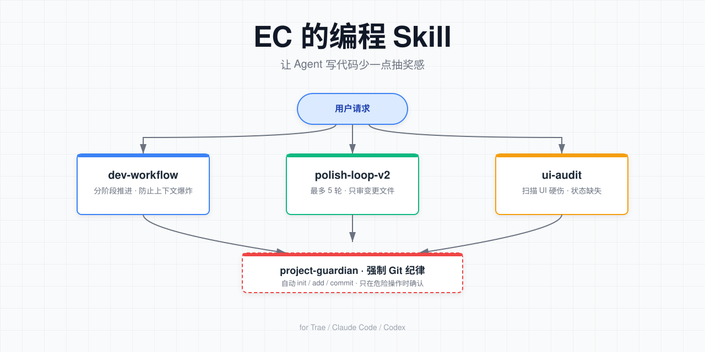

<p align="center">
  <a href="README.md">中文</a> | <a href="README.en.md">English</a>
</p>

<p align="center">
  
</p>

<p align="center">
  一套自用 AI 编程 Skill，让 Agent 写代码、审代码、管项目的过程少一点"抽奖感"
</p>

<p align="center">
  <a href="#快速开始">🚀 快速开始</a> ·
  <a href="#推荐工作流">📖 推荐工作流</a> ·
  <a href="#完整案例">📝 完整案例</a> ·
  <a href="#我们踩过的坑">🐛 踩坑记录</a>
</p>

---

## 一键使用

如果你不想手动安装，直接把下面这段 prompt 发给你的 Coding Agent（Trae / Codex / Claude Code），它会自动完成安装并解释用法：

```text
请帮我安装并配置 https://github.com/ECdison6227/coding-agent-skills 这个仓库里的 Skill：

1. 先 git clone 到临时目录
2. 运行 ./install.sh 安装 Skill
3. 告诉我安装了哪些 Skill、每个 Skill 的用途和触发词
4. 如果 Skill 需要初始化配置（如创建个人资料、设置偏好），请引导我完成
5. 最后用一个简单的例子演示如何调用其中一个 Skill
```

---

## 目录

- [为什么要做这套 Skill](#为什么要做这套-skill)
- [它能干什么 / 不能干什么](#它能干什么--不能干什么)
- [快速开始](#快速开始)
- [推荐工作流](#推荐工作流)
- [标准 Prompt](#标准-prompt)
- [完整案例](#完整案例)
- [工作原理](#工作原理)
- [关键配置](#关键配置)
- [我们踩过的坑](#我们踩过的坑)
- [限制与后续](#限制与后续)
- [相关仓库](#相关仓库)
- [交流与反馈](#交流与反馈)
- [致谢](#致谢)
- [License](#license)

---

## 为什么要做这套 Skill

我用 Trae / Claude Code / Codex 这类 Agent 工具写代码已经有一段时间了。最开始很爽：说一句"帮我做个登录页"，Agent 噼里啪啦就写完了。但用多了之后，几件烦人的事反复出现：

1. **Agent 越改越远**。第一轮改得挺好，第二轮开始顺手"优化"其他文件，第三轮直接把第一轮修好的东西又改坏了。没有轮次上限，它能跟你无限循环下去。
2. **只审代码，不跑基线**。Agent 经常静态扫一遍就说"没问题"，结果启动崩溃、路由 404、按钮点不动。
3. **前端 UI 永远差口气**。逻辑对了，但界面上到处是"确定""取消"这种模糊文案、硬编码中文、还有静态 Loading 转圈圈。
4. **不写 Git**。我跟它说"记得提交"，它说好的，然后只是口头提醒，仓库里照样一团糟。

这套 Skill 就是把这些反复踩的坑，固化成可复用的指令和脚本。不是"万能工具箱"，而是"别再犯同样的错"。

---

## 它能干什么 / 不能干什么

| 能干 | 不能干 |
|------|--------|
| 通过 `dev-workflow` 把大项目拆成 6 个阶段，防止 Agent 一次性读完全部文件 | 替你写业务代码本身，它只负责流程和约束 |
| 通过 `polish-loop-v2` 做最多 5 轮的精准审查，每轮只盯变更文件 | 保证代码 0 bug，只能降低"改一笔坏三处"的概率 |
| 通过 `ui-audit` 扫描文字符号、硬编码中文、未定义 CSS 类、缺失 loading/empty/error 状态 | 替代设计师，它只抓"明显不对" |
| 配合 [project-guardian](https://github.com/ECdison6227/project-guardian-cheap-code-delegate) 自动执行 `git init` / `add` / `commit` | 自动 `push`、`reset`、`clean` 等危险操作必须你确认 |

---

## 快速开始

```bash
# 1. 克隆仓库
git clone https://github.com/ECdison6227/coding-agent-skills.git
cd coding-agent-skills

# 2. 验证仓库完整性
./scripts/validate.sh

# 3. 安装到默认 Skill 目录
./install.sh
```

默认安装到 `~/.agents/skills`。如果你想装到其他地方：

```bash
./install.sh --target "$HOME/.codex/skills"
```

只想看看会装什么：

```bash
./install.sh --dry-run
```

---

## 推荐工作流

三个 Skill 可以串起来用，也可以单独用。推荐搭配 [project-guardian](https://github.com/ECdison6227/project-guardian-cheap-code-delegate) 一起：

```
┌─────────────────┐
│  project-guardian │ ── 自动 git init / add / commit，建立项目基线
│  （相关仓库）     │
└────────┬────────┘
         │
         ↓
┌─────────────────┐     ┌──────────────────┐     ┌──────────────────┐
│  dev-workflow   │ ──→ │  polish-loop-v2  │ ──→ │    ui-audit      │
│  拆阶段、建交接  │     │  代码审查（≤5轮） │     │  界面审查 + 扫描  │
└─────────────────┘     └──────────────────┘     └──────────────────┘
         │                       │                       │
         └───────────────────────┴───────────────────────┘
                                 ↓
                    ┌─────────────────────┐
                    │  project-guardian    │
                    │  自动提交审查后的变更 │
                    └─────────────────────┘
```

**典型流程：**

1. 用 `project-guardian` 初始化项目 + Git。
2. 用 `dev-workflow` 把需求拆成 6 个阶段，逐阶段推进。
3. 每个阶段完成后，用 `polish-loop-v2` 做代码审查。
4. 如果是前端项目，再用 `ui-audit` 做界面审查。
5. 审查通过后，`project-guardian` 自动提交。

---

## 标准 Prompt

如果你想让 AI 调用这些 Skill，可以用下面的 prompt：

### 从零开始搭项目

> 请用 dev-workflow 帮我搭这个项目：
> - 技术栈：React + TypeScript + Vite
> - 先搭框架，能跑起来就行
> - 每个阶段完成后写交接文档

### 代码审查

> 对当前项目做一次 polish-v2 审查：
> - 先跑基线（编译 + 启动）
> - 只审查变更文件，不要全量扫描
> - 最多 5 轮，连续 2 轮无 CRITICAL/HIGH 就停

### 界面审查

> 用 ui-audit 检查这个前端项目：
> - 先跑 scan-ui.sh 自动扫描
> - 重点检查文字符号、硬编码中文、缺失状态
> - 按优先级修复

---

## 完整案例

### 案例 1：从零开始做一个项目

你刚接到一个新需求，不知道让 Agent 从哪里下手。直接说：

```text
用 dev-workflow 帮我搭这个项目
```

`dev-workflow` 会：

1. 在 `.dev-workflow/` 下创建 `current-handoff.md` 交接文档。
2. 按 Phase 0 → 5 推进：需求讨论 → MVP → 基线检查 → UI Loop → 功能 Loop → 回归验证。
3. 每个子 Agent 只读交接文档和自己需要的文件，防止上下文爆炸。

示例交接文档见 [`examples/dev-workflow/handoff.example.md`](examples/dev-workflow/handoff.example.md)。

### 案例 2：审查一个改了一半的 PR

你改完一版代码，心里没底。说：

```text
对当前项目做一次 polish-v2 审查
```

`polish-loop-v2` 会：

1. 先跑编译/启动/测试，确认基线还能跑通。
2. 第 1 轮全量扫描，列出 CRITICAL / HIGH / MEDIUM / LOW 问题。
3. 后续每轮只审查 `git diff --name-only HEAD~1` 里的文件，最多 5 轮。
4. 每轮修复后重新跑基线，防止"修 A 坏 B"。

示例审查报告见 [`examples/polish-loop-v2/audit-report.example.md`](examples/polish-loop-v2/audit-report.example.md)。

### 案例 3：前端页面"看起来不对"

项目能跑，但 UI 总觉得糙。说：

```text
用 ui-audit 检查这个前端项目
```

`ui-audit` 会先跑 `scripts/scan-ui.sh` 自动扫描：

```bash
~/.agents/skills/ui-audit/scripts/scan-ui.sh ./src
```

典型输出：

```text
src/pages/Home.tsx:23  硬编码中文: "加载中..."
src/components/Button.tsx:41  未定义 CSS 类: .btn-primary-active
src/App.tsx:58  文字符号: →
```

然后按优先级修复：文字符号 → 文字简化 → 动画补全 → CSS 类补全 → i18n 补全 → 死代码删除 → 状态处理 → 导航流程。

示例扫描结果见 [`examples/ui-audit/scan-output.example.md`](examples/ui-audit/scan-output.example.md)。

---

## 工作原理

这套 Skill 的核心不是"让 Agent 更聪明"，而是"把容易出错的地方管起来"。

```
用户请求
  ↓
匹配触发词 → 加载对应 SKILL.md
  ↓
Skill 强制固定流程（如先基线 → 再审查 → 再修复 → 再回归）
  ↓
配套脚本执行可重复的检测（去重、UI 扫描、依赖检查等）
  ↓
Agent 在约束内改代码，不是自由发挥
```

每个 Skill 都包含：

- `SKILL.md`：Agent 读取的指令，定义触发词、流程、禁止事项。
- `scripts/`：可独立运行的 Bash 脚本，做 Agent 不擅长的机械检查。
- `templates/` / `automation.md` / `templates.md`：可复用的模板和检查清单。

---

## 关键配置

### Skill 触发词

| Skill | 触发词 |
|-------|--------|
| `dev-workflow` | `dev-workflow`、`软件开发`、`build app`、`software development` |
| `polish-loop-v2` | `polish-v2`、`精准审查`、`code review`、`审查代码`、`quality check` |
| `ui-audit` | `ui-audit`、`UI审查`、`界面审查`、`前端审查`、`interaction review` |

### 项目结构

```text
.
├── install.sh                  # 安装脚本
├── scripts/
│   └── validate.sh             # 仓库验证
├── skills/
│   ├── dev-workflow/           # 流程协调
│   ├── polish-loop-v2/         # 代码审查
│   └── ui-audit/               # 界面审查
├── examples/                   # 示例文件
├── assets/
│   └── banner.svg              # 流程图 banner
├── AGENTS.md                   # 给 AI Agent 的项目指引
├── CONTRIBUTING.md             # 贡献指南
├── CHANGELOG.md                # 版本变更记录
├── SECURITY.md                 # 安全策略
└── LICENSE
```

---

## 我们踩过的坑

### 第一版：polish-loop 没有轮次上限

**现象**：Agent 审查了 8 轮还在说"还有可以优化的地方"，永远结束不了。

**原因**：没有硬性停止条件，Agent 倾向于继续找问题以显得"尽责"。

**修复**：`polish-loop-v2` 明确最多 5 轮，停止条件四选一：达到上限、连续 2 轮无 CRITICAL/HIGH、回归全过且只剩 LOW、用户主动停止。

### 第二版：project-guardian 只提醒不执行 Git

**现象**：Agent 每次都说"建议提交一下"，但仓库里根本没 commit。

**原因**：原 Skill 写成了"Ask before git init/add/commit"，Agent 理解为"提醒即可"。

**修复**：把 `project-guardian` 改为自动执行 `git init` / `git add -A` / `git commit`，只有 `push`、`reset`、`clean` 才需要确认。相关仓库见 [project-guardian-cheap-code-delegate](https://github.com/ECdison6227/project-guardian-cheap-code-delegate)。

### 第三版：ui-audit 扫描脚本在 macOS 上报错

**现象**：`grep -E '[→←↑↓×+\-><✓!~%$€¥]'` 在 macOS 的 BSD grep 下报 `invalid character range`。

**原因**：BSD grep 对 Unicode 范围支持不好。

**修复**：把 grep 换成 `perl`，中文检测加 `-CSD` 处理 UTF-8。

### 第四版：README 写得像产品说明书

**现象**：第一版 README 开头是"本项目是一个高效的 AI 编程 Skill 集合"。

**原因**：AI 味太重，没有真实场景。

**修复**：就是你正在看的这一版。

---

## 限制与后续

**已知限制：**

- Skill 目前主要适配 Trae / Claude Code / Codex 这类支持 `.agents/skills` 目录的 Agent 环境，其他环境可能需要手动调整路径。
- `ui-audit` 的自动化扫描只能抓"明显问题"，视觉美感仍需人工判断。
- `polish-loop-v2` 的 5 轮上限是经验值，复杂项目可能需要手动扩轮次。

**欢迎 PR：**

- 补充更多 Agent 环境的适配（如 Cline、Continue）
- 把 ui-audit 扫描脚本扩展到 Vue / Svelte 项目
- 把 validate.sh 改成 GitHub Actions workflow

---

## 相关仓库

- [project-guardian-cheap-code-delegate](https://github.com/ECdison6227/project-guardian-cheap-code-delegate) — 另一个配套 skill 仓库：
  - `project-guardian`：项目边界管理、`.ai` 记忆文件、**强制 Git 纪律**
  - `cheap-code-delegate`：token/成本感知的低成本代码审查委派

搭配用法：先用 `project-guardian` 建立项目记忆和 Git 基线，再用本仓库的 `polish-loop-v2` / `ui-audit` 做审查。

---

## 交流与反馈

- **Bug / 建议**：请[提 Issue](https://github.com/ECdison6227/coding-agent-skills/issues)，使用仓库里的模板。
- **安全漏洞**：请勿公开 Issue，见 [SECURITY.md](SECURITY.md)。
- **贡献代码**：见 [CONTRIBUTING.md](CONTRIBUTING.md)。
- **AI Agent 指引**：见 [AGENTS.md](AGENTS.md)。

---

## 致谢

- 感谢 Trae、Claude Code、Codex 这些 Agent 工具，让我有机会把"踩过的坑"变成"可复用的 Skill"。
- 感谢 GitHub 上各种开源的代码审查清单和 UI 设计规范，这套 Skill 很多地方是站在它们肩膀上整理的。

---

## License

MIT License。见 [LICENSE](LICENSE)。
